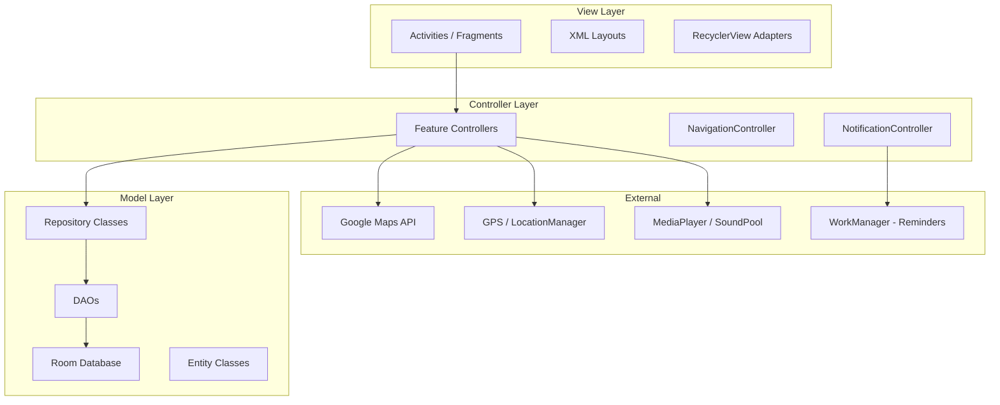
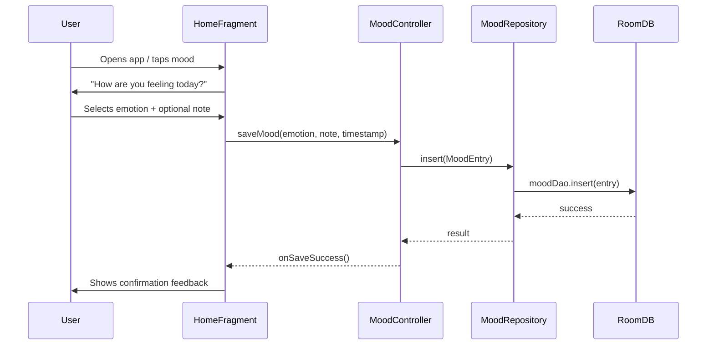
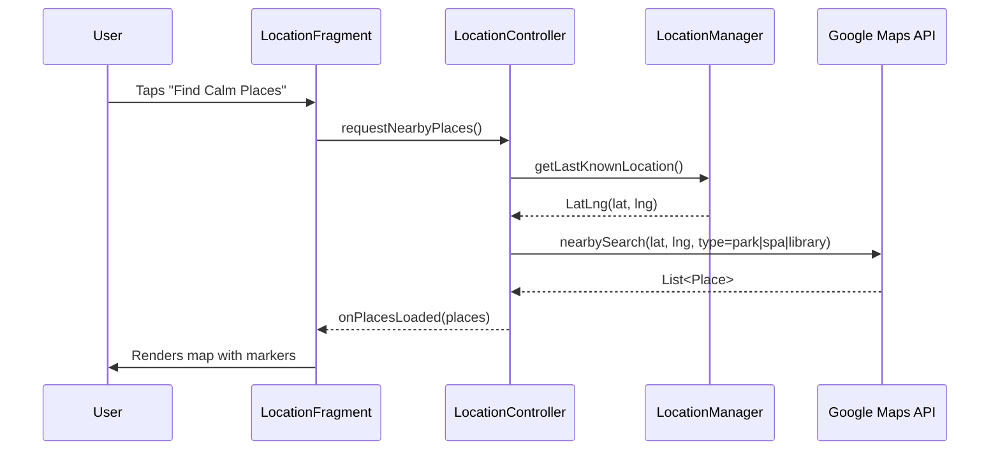
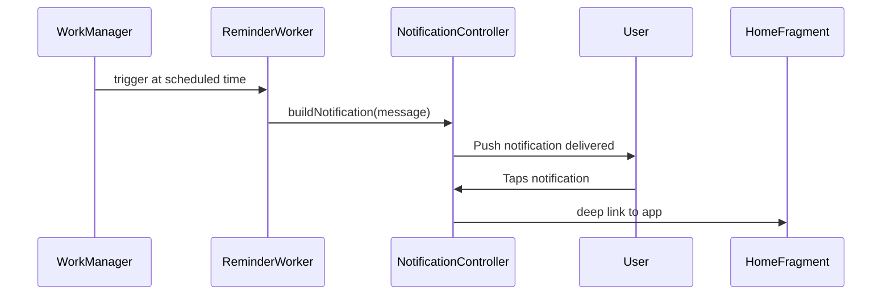

# Design Document: Calm Connect

## Overview

Calm Connect is a native Android mental wellness application built in Kotlin using the MVC architecture pattern. It provides users with mood tracking, stress relief tools, soundscapes, motivational content, mindful games, GPS-based calm location discovery, and daily routine guidance — all backed by a local Room database with a soft, minimalist UI.

The app is structured around five core navigation areas (Home, Today, Tools, Profile, and a persistent bottom nav bar) and integrates Google Maps for location-based features. All user data is stored locally using Room with full CRUD support, and a daily reminder system delivers gentle push notifications to encourage consistent engagement.

---

## Architecture

The app follows the MVC (Model-View-Controller) pattern across all feature modules.



---

## Sequence Diagrams

### Mood Check-In Flow



### Calm Location Discovery Flow



### Daily Reminder Flow



---

## Components and Interfaces

### 1. MoodController

**Purpose**: Handles mood check-in, retrieval, and history aggregation.

**Interface**:
```kotlin
interface MoodController {
    fun saveMood(emotion: String, note: String?, timestamp: Long): Result<Unit>
    fun getMoodHistory(): LiveData<List<MoodEntry>>
    fun getMoodForDate(date: LocalDate): MoodEntry?
    fun deleteMood(id: Int): Result<Unit>
}
```

**Responsibilities**:
- Validate emotion selection before saving
- Persist mood entries via MoodRepository
- Provide mood history for chart rendering

---

### 2. SoundController

**Purpose**: Manages playback of ambient soundscapes.

**Interface**:
```kotlin
interface SoundController {
    fun play(soundType: SoundType)
    fun pause()
    fun stop()
    fun setTimer(durationMinutes: Int)
    fun setVolume(level: Float)
}

enum class SoundType { RAIN_DROPS, OCEAN_WAVES, GENTLE_PIANO, FOREST_AMBIENCE }
```

**Responsibilities**:
- Load and stream audio assets via MediaPlayer
- Handle timer-based auto-stop
- Manage audio focus lifecycle

---

### 3. QuoteController

**Purpose**: Fetches and manages motivational quotes.

**Interface**:
```kotlin
interface QuoteController {
    fun getDailyQuote(): Quote
    fun saveToFavorites(quoteId: Int): Result<Unit>
    fun getFavoriteQuotes(): LiveData<List<Quote>>
    fun searchQuotes(query: String): List<Quote>
    fun removeFavorite(quoteId: Int): Result<Unit>
}
```

**Responsibilities**:
- Select daily quote based on date seed
- Persist favorites to Room
- Support search across quote text and author

---

### 4. StressReliefController

**Purpose**: Coordinates breathing exercises, guided meditation, and journaling.

**Interface**:
```kotlin
interface StressReliefController {
    fun startBreathingExercise(pattern: BreathingPattern): BreathingSession
    fun startMeditation(durationMinutes: Int): MeditationSession
    fun saveJournalEntry(text: String, timestamp: Long): Result<Unit>
    fun getJournalEntries(): LiveData<List<JournalEntry>>
}

enum class BreathingPattern { BOX_4_4_4_4, RELAXING_4_7_8, ENERGIZING_2_2_4 }
```

---

### 5. StudyTimerController

**Purpose**: Manages Pomodoro-style study sessions.

**Interface**:
```kotlin
interface StudyTimerController {
    fun startSession(workMinutes: Int, breakMinutes: Int)
    fun pause()
    fun resume()
    fun reset()
    fun getSessionState(): LiveData<TimerState>
}

data class TimerState(
    val phase: TimerPhase,       // WORK, SHORT_BREAK, LONG_BREAK
    val remainingSeconds: Int,
    val completedPomodoros: Int
)
```

---

### 6. GameController

**Purpose**: Manages mindful game sessions and scoring.

**Interface**:
```kotlin
interface GameController {
    fun startGame(type: GameType): GameSession
    fun recordScore(type: GameType, score: Int)
    fun getHighScore(type: GameType): Int
}

enum class GameType { TAPPING, MEMORY, BREATHING }
```

---

### 7. LocationController

**Purpose**: Handles GPS and Google Maps integration for calm place discovery.

**Interface**:
```kotlin
interface LocationController {
    fun requestCurrentLocation(callback: (LatLng) -> Unit)
    fun findNearbyPlaces(latLng: LatLng, radiusMeters: Int): LiveData<List<CalmPlace>>
    fun searchPlaces(query: String, latLng: LatLng): List<CalmPlace>
}
```

---

### 8. RoutineController

**Purpose**: Manages daily guided routine steps and progress tracking.

**Interface**:
```kotlin
interface RoutineController {
    fun getTodayRoutine(): LiveData<List<RoutineStep>>
    fun markStepComplete(stepId: Int): Result<Unit>
    fun resetDailyRoutine()
    fun getCompletionPercentage(): Float
}
```

---

### 9. ProfileController

**Purpose**: Manages user profile data, avatar, and settings.

**Interface**:
```kotlin
interface ProfileController {
    fun getProfile(): LiveData<UserProfile>
    fun updateName(name: String): Result<Unit>
    fun updateProfilePicture(uri: Uri): Result<Unit>
    fun toggleDarkMode(enabled: Boolean)
    fun logout()
}
```

---

### 10. NotificationController

**Purpose**: Schedules and delivers daily reminder notifications.

**Interface**:
```kotlin
interface NotificationController {
    fun scheduleDaily(hour: Int, minute: Int, message: String)
    fun cancelReminder()
    fun isReminderActive(): Boolean
}
```

---

## Data Models

### MoodEntry

```kotlin
@Entity(tableName = "mood_entries")
data class MoodEntry(
    @PrimaryKey(autoGenerate = true) val id: Int = 0,
    val emotion: String,        // e.g. "Happy", "Anxious", "Calm"
    val note: String?,
    val timestamp: Long,        // epoch millis
    val date: String            // "yyyy-MM-dd" for daily lookup
)
```

**Validation Rules**:
- `emotion` must be non-empty and from the predefined emotion set
- `timestamp` must be a valid positive epoch value
- `note` is optional, max 500 characters

---

### Quote

```kotlin
@Entity(tableName = "quotes")
data class Quote(
    @PrimaryKey val id: Int,
    val text: String,
    val author: String,
    val isFavorite: Boolean = false
)
```

---

### JournalEntry

```kotlin
@Entity(tableName = "journal_entries")
data class JournalEntry(
    @PrimaryKey(autoGenerate = true) val id: Int = 0,
    val text: String,
    val timestamp: Long,
    val date: String
)
```

**Validation Rules**:
- `text` must be non-empty, max 2000 characters

---

### RoutineStep

```kotlin
@Entity(tableName = "routine_steps")
data class RoutineStep(
    @PrimaryKey val id: Int,
    val title: String,
    val description: String,
    val durationMinutes: Int,
    val isCompleted: Boolean = false,
    val date: String            // resets daily
)
```

---

### UserProfile

```kotlin
@Entity(tableName = "user_profile")
data class UserProfile(
    @PrimaryKey val id: Int = 1,   // single-row table
    val name: String,
    val profilePictureUri: String?,
    val isDarkMode: Boolean = false,
    val reminderHour: Int = 8,
    val reminderMinute: Int = 0,
    val reminderEnabled: Boolean = true
)
```

---

### CalmPlace (in-memory, not persisted)

```kotlin
data class CalmPlace(
    val placeId: String,
    val name: String,
    val address: String,
    val latLng: LatLng,
    val type: String,           // "park", "library", "spa", etc.
    val rating: Float?
)
```

---

## Algorithmic Pseudocode

### Mood Check-In Algorithm

```pascal
PROCEDURE saveMoodEntry(emotion, note, timestamp)
  INPUT: emotion: String, note: String?, timestamp: Long
  OUTPUT: Result (Success | Error)

  PRECONDITIONS:
    emotion IS NOT NULL AND emotion IS NOT EMPTY
    emotion IN VALID_EMOTIONS_SET
    timestamp > 0

  BEGIN
    IF emotion IS NULL OR emotion IS EMPTY THEN
      RETURN Error("Emotion must be selected")
    END IF

    IF emotion NOT IN VALID_EMOTIONS_SET THEN
      RETURN Error("Invalid emotion value")
    END IF

    IF note IS NOT NULL AND LENGTH(note) > 500 THEN
      RETURN Error("Note exceeds 500 characters")
    END IF

    date ← formatDate(timestamp, "yyyy-MM-dd")
    entry ← MoodEntry(emotion, note, timestamp, date)
    moodRepository.insert(entry)

    RETURN Success

  POSTCONDITIONS:
    entry EXISTS IN database
    entry.date EQUALS formatDate(timestamp)
  END
END PROCEDURE
```

---

### Daily Quote Selection Algorithm

```pascal
PROCEDURE getDailyQuote()
  OUTPUT: Quote

  BEGIN
    today ← getCurrentDate()
    seed ← hashDate(today)
    index ← seed MOD LENGTH(ALL_QUOTES)
    RETURN ALL_QUOTES[index]
  END

  POSTCONDITIONS:
    Same date always returns same quote
    index IS IN RANGE [0, LENGTH(ALL_QUOTES) - 1]
END PROCEDURE
```

---

### Breathing Exercise Timer Algorithm

```pascal
PROCEDURE runBreathingSession(pattern)
  INPUT: pattern: BreathingPattern
  OUTPUT: BreathingSession

  BEGIN
    phases ← getPhases(pattern)
    // e.g. BOX_4_4_4_4 → [INHALE:4, HOLD:4, EXHALE:4, HOLD:4]

    WHILE session.isActive DO
      FOR each phase IN phases DO
        ASSERT phase.durationSeconds > 0
        displayPhase(phase.label)
        animateCircle(phase.type)
        countdown(phase.durationSeconds)
      END FOR
    END WHILE

  LOOP INVARIANT:
    At start of each phase iteration, session.isActive = true
    phase.durationSeconds > 0 for all phases

  POSTCONDITIONS:
    All phases completed in order
    UI reflects current phase at all times
  END
END PROCEDURE
```

---

### Pomodoro Timer Algorithm

```pascal
PROCEDURE runPomodoroSession(workMinutes, breakMinutes)
  INPUT: workMinutes: Int, breakMinutes: Int
  OUTPUT: TimerState updates via LiveData

  PRECONDITIONS:
    workMinutes IN RANGE [1, 60]
    breakMinutes IN RANGE [1, 30]

  BEGIN
    completedPomodoros ← 0

    WHILE session.isActive DO
      // Work phase
      phase ← WORK
      remainingSeconds ← workMinutes * 60

      WHILE remainingSeconds > 0 AND session.isActive DO
        ASSERT remainingSeconds >= 0
        emitState(phase, remainingSeconds, completedPomodoros)
        wait(1 second)
        remainingSeconds ← remainingSeconds - 1
      END WHILE

      completedPomodoros ← completedPomodoros + 1

      // Break phase
      IF completedPomodoros MOD 4 = 0 THEN
        phase ← LONG_BREAK
        breakDuration ← breakMinutes * 3
      ELSE
        phase ← SHORT_BREAK
        breakDuration ← breakMinutes * 60
      END IF

      remainingSeconds ← breakDuration
      WHILE remainingSeconds > 0 AND session.isActive DO
        emitState(phase, remainingSeconds, completedPomodoros)
        wait(1 second)
        remainingSeconds ← remainingSeconds - 1
      END WHILE
    END WHILE

  LOOP INVARIANT:
    remainingSeconds >= 0 at all times
    completedPomodoros increases monotonically

  POSTCONDITIONS:
    completedPomodoros accurately reflects completed work phases
  END
END PROCEDURE
```

---

### Nearby Calm Places Algorithm

```pascal
PROCEDURE findNearbyPlaces(latLng, radiusMeters)
  INPUT: latLng: LatLng, radiusMeters: Int
  OUTPUT: List<CalmPlace>

  PRECONDITIONS:
    latLng IS NOT NULL
    latLng.lat IN RANGE [-90, 90]
    latLng.lng IN RANGE [-180, 180]
    radiusMeters IN RANGE [100, 50000]

  BEGIN
    placeTypes ← ["park", "library", "spa", "natural_feature", "campground"]
    results ← []

    FOR each type IN placeTypes DO
      response ← googleMapsAPI.nearbySearch(latLng, radiusMeters, type)
      IF response.isSuccess THEN
        results.addAll(response.places)
      END IF
    END FOR

    results ← removeDuplicates(results)
    results ← sortByDistance(results, latLng)

    RETURN results

  POSTCONDITIONS:
    All returned places are within radiusMeters of latLng
    No duplicate placeIds in results
    Results sorted ascending by distance
  END
END PROCEDURE
```

---

### Routine Progress Algorithm

```pascal
PROCEDURE getCompletionPercentage()
  OUTPUT: Float in range [0.0, 1.0]

  BEGIN
    steps ← routineRepository.getTodaySteps()

    IF LENGTH(steps) = 0 THEN
      RETURN 0.0
    END IF

    completedCount ← COUNT(step IN steps WHERE step.isCompleted = true)
    percentage ← completedCount / LENGTH(steps)

    RETURN percentage

  POSTCONDITIONS:
    result IN RANGE [0.0, 1.0]
    result = 1.0 IFF all steps are completed
    result = 0.0 IFF no steps are completed
  END
END PROCEDURE
```

---

## Key Functions with Formal Specifications

### MoodRepository.insert()

```kotlin
fun insert(entry: MoodEntry): Result<Unit>
```

**Preconditions**:
- `entry.emotion` is non-empty and in the valid emotions set
- `entry.timestamp` > 0
- `entry.date` matches `yyyy-MM-dd` format

**Postconditions**:
- Entry is persisted in Room `mood_entries` table
- `entry.id` is auto-assigned a positive integer
- No existing entries are modified

**Loop Invariants**: N/A

---

### QuoteRepository.getFavorites()

```kotlin
fun getFavorites(): LiveData<List<Quote>>
```

**Preconditions**: None

**Postconditions**:
- Returns all quotes where `isFavorite = true`
- Result is a LiveData that updates reactively on DB changes
- Empty list returned if no favorites exist

---

### RoutineController.markStepComplete()

```kotlin
fun markStepComplete(stepId: Int): Result<Unit>
```

**Preconditions**:
- `stepId` corresponds to an existing RoutineStep for today's date
- Step is not already marked complete

**Postconditions**:
- `step.isCompleted` is set to `true` in the database
- `getCompletionPercentage()` value increases or stays the same
- No other steps are modified

---

### ProfileController.updateProfilePicture()

```kotlin
fun updateProfilePicture(uri: Uri): Result<Unit>
```

**Preconditions**:
- `uri` is a valid content URI pointing to an image file
- Image file exists and is readable

**Postconditions**:
- URI is persisted in `user_profile` table
- Previous URI is overwritten
- UI observing `getProfile()` LiveData receives updated value

---

## Example Usage

```kotlin
// Mood Check-In
val controller: MoodController = MoodControllerImpl(moodRepository)
val result = controller.saveMood(
    emotion = "Calm",
    note = "Had a peaceful morning walk",
    timestamp = System.currentTimeMillis()
)
when (result) {
    is Result.Success -> showConfirmation()
    is Result.Error -> showError(result.message)
}

// Play Soundscape with 30-min timer
val soundController: SoundController = SoundControllerImpl(context)
soundController.play(SoundType.RAIN_DROPS)
soundController.setTimer(30)

// Get Daily Quote
val quoteController: QuoteController = QuoteControllerImpl(quoteRepository)
val quote = quoteController.getDailyQuote()
binding.quoteText.text = quote.text
binding.quoteAuthor.text = "— ${quote.author}"

// Start Breathing Exercise
val stressController: StressReliefController = StressReliefControllerImpl()
val session = stressController.startBreathingExercise(BreathingPattern.BOX_4_4_4_4)

// Find Nearby Calm Places
val locationController: LocationController = LocationControllerImpl(context, mapsClient)
locationController.requestCurrentLocation { latLng ->
    locationController.findNearbyPlaces(latLng, 5000).observe(viewLifecycleOwner) { places ->
        mapAdapter.submitList(places)
    }
}

// Pomodoro Timer
val timerController: StudyTimerController = StudyTimerControllerImpl()
timerController.startSession(workMinutes = 25, breakMinutes = 5)
timerController.getSessionState().observe(viewLifecycleOwner) { state ->
    binding.timerText.text = formatTime(state.remainingSeconds)
    binding.phaseLabel.text = state.phase.label
}
```

---

## Correctness Properties

*A property is a characteristic or behavior that should hold true across all valid executions of a system — essentially, a formal statement about what the system should do.*

### Property 1: Mood save round-trip

*For any* valid MoodEntry, saving it via MoodController and then retrieving getMoodHistory should return a list that contains an entry with the same emotion, note, and timestamp.

**Validates: Requirements 1.1, 2.1**

---

### Property 2: Daily quote determinism

*For any* calendar date, calling QuoteController.getDailyQuote twice on the same date should return the same Quote object.

**Validates: Requirements 4.1**

---

### Property 3: Routine completion percentage bounds

*For any* combination of completed and total RoutineStep counts for today, RoutineController.getCompletionPercentage should return a value in the range [0.0, 1.0].

**Validates: Requirements 9.4**

---

### Property 4: Pomodoro remainingSeconds non-negative

*For any* valid Pomodoro session configuration, remainingSeconds emitted by StudyTimerController should never be less than zero at any tick.

**Validates: Requirements 6.4**

---

### Property 5: Nearby places within radius

*For any* LatLng and radiusMeters, all CalmPlace objects returned by LocationController.findNearbyPlaces should have a distance from the provided LatLng that is less than or equal to radiusMeters.

**Validates: Requirements 8.2**

---

### Property 6: Favorite quote round-trip

*For any* Quote, calling saveToFavorites then getFavoriteQuotes should return a list that includes that Quote with isFavorite set to true.

**Validates: Requirements 4.3, 4.4**

---

### Property 7: Dark mode preference persistence

*For any* boolean value passed to ProfileController.toggleDarkMode, calling getProfile after should return a UserProfile where isDarkMode equals that boolean value.

**Validates: Requirements 10.5, 11.3**

---

### Property 8: Breathing phase order

*For any* BreathingPattern, the phases executed by StressReliefController during a session should match the declared phase sequence of that pattern in the correct order.

**Validates: Requirements 5.1**

---

## Error Handling

### GPS Permission Denied

**Condition**: User denies location permission  
**Response**: Show rationale dialog explaining why location is needed  
**Recovery**: Offer manual city/area search as fallback; disable map markers gracefully

### Google Maps API Failure

**Condition**: Network unavailable or API quota exceeded  
**Response**: Show "Unable to load places" message with retry button  
**Recovery**: Cache last successful results and display with a "last updated" timestamp

### Room Database Error

**Condition**: Insert/query fails due to constraint violation or disk error  
**Response**: Return `Result.Error` with descriptive message; log error  
**Recovery**: Retry once; if persistent, show user-facing error toast

### Audio Playback Failure

**Condition**: Audio asset missing or audio focus denied  
**Response**: Show "Unable to play sound" snackbar  
**Recovery**: Release MediaPlayer resources; allow user to retry

### Invalid Mood Submission

**Condition**: User submits without selecting an emotion  
**Response**: Highlight emotion selector with error state  
**Recovery**: Block save action until valid emotion is selected

### Notification Permission Denied (Android 13+)

**Condition**: User denies POST_NOTIFICATIONS permission  
**Response**: Inform user reminders won't work; don't crash  
**Recovery**: Provide settings shortcut to re-enable in system settings

---

## Testing Strategy

### Unit Testing Approach

Test each Controller in isolation using mock Repositories. Key test cases:

- `MoodController.saveMood()` with valid/invalid inputs
- `QuoteController.getDailyQuote()` returns same quote for same date
- `RoutineController.getCompletionPercentage()` returns 0.0 for empty, 1.0 for all complete
- `StudyTimerController` phase transitions (WORK → SHORT_BREAK → LONG_BREAK after 4 pomodoros)
- `ProfileController.updateName()` with empty string should return error

### Property-Based Testing Approach

**Property Test Library**: JUnit 5 + [junit-quickcheck](https://github.com/pholser/junit-quickcheck) or Kotest property testing

Key properties to test:

- Mood history always contains all inserted entries (no data loss)
- Daily quote index is always within bounds of quote list
- Routine completion percentage is always in `[0.0, 1.0]`
- Pomodoro `remainingSeconds` never goes below 0
- Nearby places search never returns places outside the given radius

### Integration Testing Approach

- Room DAO tests using in-memory database (`Room.inMemoryDatabaseBuilder`)
- End-to-end mood save → history retrieval flow
- Routine step completion → percentage update flow
- Profile update → LiveData emission verification

---

## Performance Considerations

- Room queries run on background threads via coroutines (`Dispatchers.IO`); never on main thread
- Soundscape audio files streamed from assets, not loaded fully into memory
- Google Maps markers clustered when > 10 results to avoid UI jank
- Mood chart renders using a lightweight charting library (MPAndroidChart) with data sampling for large histories
- Profile images resized/compressed before storing URI to avoid large bitmap allocations
- WorkManager used for reminders (battery-efficient, survives reboots)

---

## Security Considerations

- No user credentials stored in plaintext; if auth is added later, use Android Keystore
- Profile picture URIs validated before use to prevent path traversal
- Google Maps API key stored in `local.properties` and referenced via `BuildConfig`, never hardcoded
- Room database stored in app-private internal storage (not accessible to other apps without root)
- Journal entries and mood notes are sensitive; consider enabling `FLAG_SECURE` on relevant screens to prevent screenshots

---

## Dependencies

| Dependency | Purpose |
|---|---|
| `androidx.room` | Local database (CRUD for all entities) |
| `androidx.lifecycle` (LiveData, ViewModel) | Reactive UI updates |
| `androidx.work` (WorkManager) | Scheduled daily reminders |
| `com.google.android.gms:play-services-maps` | Google Maps rendering |
| `com.google.android.gms:play-services-location` | GPS / FusedLocationProvider |
| `com.google.android.libraries.places` | Nearby Places API |
| `com.github.PhilJay:MPAndroidChart` | Mood history chart |
| `androidx.navigation` | Fragment navigation with bottom nav |
| `kotlinx.coroutines` | Async DB and network operations |
| `androidx.datastore` | Lightweight preference storage (dark mode, reminder settings) |
| `Glide` or `Coil` | Profile picture loading and caching |
| `JUnit 5` + `Kotest` | Unit and property-based testing |
| `androidx.room:room-testing` | In-memory DB for integration tests |
